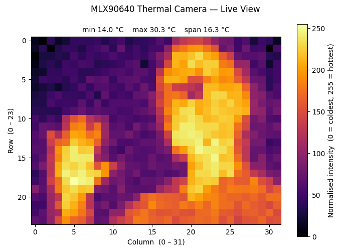

# ThermalCam — MLX90640 Thermal Imaging on nRF54L15

A Zephyr RTOS application that reads frames from an MLX90640 32×24 thermal camera and renders them as an ASCII heat map on the RTT/UART log.

---

## Hardware

| Component | Details |
|-----------|---------|
| MCU board | Nordic Semiconductor **nRF54L15 DK** |
| Sensor | **Melexis MLX90640** — 32×24 IR thermal array |
| Sensor I2C address | `0x33` (factory default) |
| Sensor supply voltage | **3.3 V** |

> **Important — DK voltage configuration:** The MLX90640 module requires a **3.3 V** supply. The nRF54L15 DK's GPIO header voltage must be set accordingly before powering the sensor. By default the DK is shipped with a VDD rail setting of 1.8V, so you'll need to do the follwing change to supply the camera module properly!
> Open **nRF Connect for Desktop → Board Configurator**, select your DK, and set **VDD (nPM VOUT1)** to **3.3 V**. Configure your board by clicking "Write config". Please note that this changes the VDD rail of all GPIO ports, just in case you have other HW connected to it make sure that it is 3.3V compliant.

---

## I2C Wiring

The sensor is connected to the **I2C21 (TWIM1)** peripheral of the nRF54L15 DK.

| Signal | nRF54L15 DK pin | Header |
|--------|-----------------|--------|
| SCL    | **P1.11**       | General-purpose header (no board hardware) |
| SDA    | **P1.12**       | General-purpose header (no board hardware) |
| VDD    | 3.3 V           | Use Board Configurator to set VDD to 3.3V |
| GND    | GND             | |

> **Note:** Both pins are free general-purpose header pins on the nRF54L15 DK — no PCB modification is required. Pull-up resistors are enabled in firmware via `bias-pull-up` in the device tree overlay. The I2C bus runs at **400 kHz** (Fast Mode).

---

## Prerequisites

- **Visual Studio Code** with the [**nRF Connect for VS Code**](https://www.nordicsemi.com/Products/Development-tools/nRF-Connect-for-VS-Code) extension pack installed.
- **nRF Connect SDK v3.2.4** — the application was built and tested against this version. Select it in the nRF Connect extension's *Toolchain Manager* before building.

---

## Build Configuration

1. Open VS Code in this folder.
2. In the **nRF Connect** side-panel, click **Add Build Configuration**.
3. Choose the board **`nrf54l15dk/nrf54l15/cpuapp`**.
4. Leave all other settings at their defaults and click **Build Configuration**.
5. After a successful build, click **Flash** to program the DK.

The application overlay ([app.overlay](app.overlay)) and project configuration ([prj.conf](prj.conf)) are picked up automatically by the build system — no extra CMake variables are required.

---

## Sample Output

The application prints a statistics header followed by a 24-row ASCII heat map every 5 seconds:

```
[00:00:27.514,721] <inf> main: +--------------------------------+
[00:00:27.521,183] <inf> main: | MLX90640   32 x 24  greyscale  |
[00:00:27.527,722] <inf> main: | min      22.7 C                  |
[00:00:27.534,423] <inf> main: | max      35.7 C                  |
[00:00:27.541,128] <inf> main: | mean     26.9 C                  |
[00:00:27.547,831] <inf> main: | span     12.9 C                  |
[00:00:27.554,529] <inf> main: +--------------------------------+
[00:00:27.561,074] <inf> main: |+                   .. . .  .. .|
[00:00:27.567,603] <inf> main: |+    .     .       ....... .. ..|
[00:00:27.574,131] <inf> main: |                ..****+..  ..   |
[00:00:27.580,662] <inf> main: |    .          ..+oooo++.. ... .|
[00:00:27.587,194] <inf> main: |   .        .  .*oo##ooo...  .  |
[00:00:27.593,722] <inf> main: | . .           .ooo#o##o+.....  |
[00:00:27.600,253] <inf> main: |.           . .+o#######++...  .|
[00:00:27.606,785] <inf> main: |              .*#o##o#o#*..... .|
[00:00:27.613,313] <inf> main: | .            .+**o*++++++  . ..|
[00:00:27.619,843] <inf> main: |..  .        ..+++oo+++**+.... .|
[00:00:27.626,384] <inf> main: |    .         .+**##***oo*. ..  |
[00:00:27.632,911] <inf> main: |              .*ooo##oooo*......|
[00:00:27.639,439] <inf> main: |.  .          .*######o#o+..  ..|
[00:00:27.645,970] <inf> main: | .    .       .*oo######*+..   .|
[00:00:27.652,499] <inf> main: |.  .       .  .+########++.... .|
[00:00:27.659,029] <inf> main: |.              +o######o........|
[00:00:27.665,561] <inf> main: |..     ..   .   oo#####o..... . |
[00:00:27.672,090] <inf> main: |... .    .  .. .+oo####o.. .... |
[00:00:27.678,618] <inf> main: |.. . .      .  .+o######+.... ..|
[00:00:27.685,148] <inf> main: | .......   ... ..*#@####++......|
[00:00:27.691,675] <inf> main: |.. ... .     .+.*o####****++....|
[00:00:27.698,206] <inf> main: |.....  . .  ..+*oo##oo*oo***++.+|
[00:00:27.704,739] <inf> main: |.. . .  ...++***##oooooooooooo++|
[00:00:27.711,267] <inf> main: |+..... ...+*****ooooo****o*o****|
[00:00:27.717,785] <inf> main: +--------------------------------+
```

### ASCII palette (cold → hot)

| Character | Meaning |
|-----------|---------|
| ` ` (space) | Background / very cold |
| `.` | Cool |
| `+` | Below ambient |
| `*` | Near ambient |
| `o` | Warm |
| `#` | Hot |
| `@` | Very hot |

---

## BLE Interface

In addition to the UART/RTT log output, the firmware continuously streams live thermal frames over **Bluetooth LE** using the **Nordic UART Service (NUS)**. This allows a PC or phone to receive and display the thermal image in real time.

### BLE configuration

| Parameter | Value |
|-----------|-------|
| Role | Peripheral (advertises as `"ThermalCam"`) |
| Service | Nordic UART Service (NUS) |
| NUS TX characteristic UUID | `6e400003-b5a3-f393-e0a9-e50e24dcca9e` |
| LL data length | 251 bytes (DLE enabled) |
| ATT MTU | 247 bytes |
| Frame rate | One frame every 5 seconds (see `MLX90640_READ_INTERVAL_S`) |

### Wire protocol

Each frame is a fixed **776-byte** packet transmitted as a series of NUS TX notifications. All multi-byte integers are **big-endian**.

| Offset | Size | Type | Content |
|--------|------|------|---------|
| 0 | 2 | `uint8[2]` | Start-of-frame marker: `0xFF 0xFE` |
| 2 | 2 | `int16` | `t_min × 10` — coldest pixel temperature × 10 (e.g. `227` = 22.7 °C) |
| 4 | 2 | `int16` | `t_max × 10` — hottest pixel temperature × 10 |
| 6 | 768 | `uint8[768]` | Pixels in row-major order (24 rows × 32 cols). `0` = coldest, `255` = hottest. |
| 774 | 2 | `uint8[2]` | End-of-frame marker: `0xFF 0xFD` |

The pixel values are linearly scaled between `t_min` and `t_max` within each frame, so the full 0–255 range is always used regardless of absolute temperature.

---

## Live Viewer — `thermal_viewer.py`

`thermal_viewer.py` is a Python script that connects to the device over BLE and displays the thermal image in a real-time matplotlib window.

### Requirements

- **Python 3.9+**
- Packages: `bleak`, `numpy`, `matplotlib >= 3.9`

### Setup

Create a virtual environment and install the dependencies (run once):

```powershell
python -m venv .venv
.venv\Scripts\Activate.ps1          # PowerShell
# or: .venv\Scripts\activate.bat   # cmd.exe

pip install "bleak" "numpy" "matplotlib>=3.9"
```

> **Note — PowerShell execution policy:** If `Activate.ps1` is blocked, run once:
> ```powershell
> Set-ExecutionPolicy -Scope CurrentUser RemoteSigned
> ```

### Running

1. Power the nRF54L15 DK and make sure the firmware is running (the UART log should show `Advertising as "ThermalCam"`).
2. Activate the virtual environment (if not already active):
   ```powershell
   .venv\Scripts\Activate.ps1
   ```
3. Run the viewer:
   ```powershell
   python thermal_viewer.py
   ```

The script will scan for a BLE device named `ThermalCam`, connect automatically, start receiving notifications, and open a live colour-mapped plot window (inferno colour map, cold = dark, hot = bright). The title bar of the plot updates with the current min / max / span temperatures for each received frame.

Close the plot window to disconnect and exit.



### Architecture note

The BLE stack (bleak / asyncio) runs in a **background thread**; the matplotlib GUI runs on the **main thread**. This prevents the GUI event loop from starving the asyncio event loop, which is a common pitfall on Windows.

